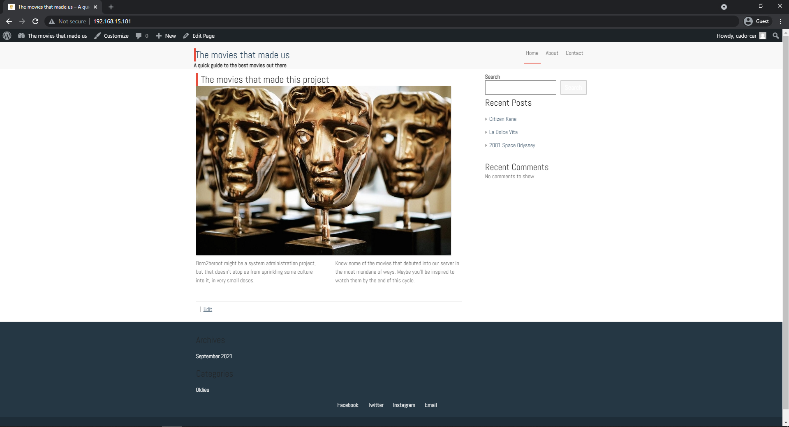
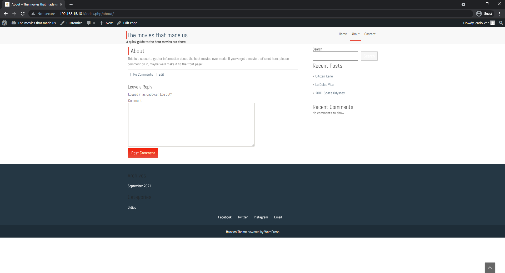
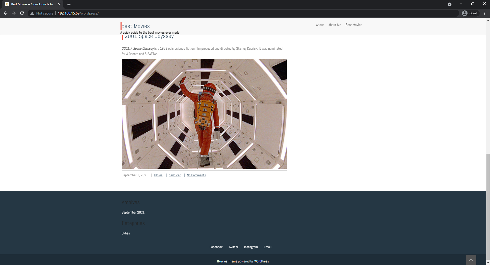
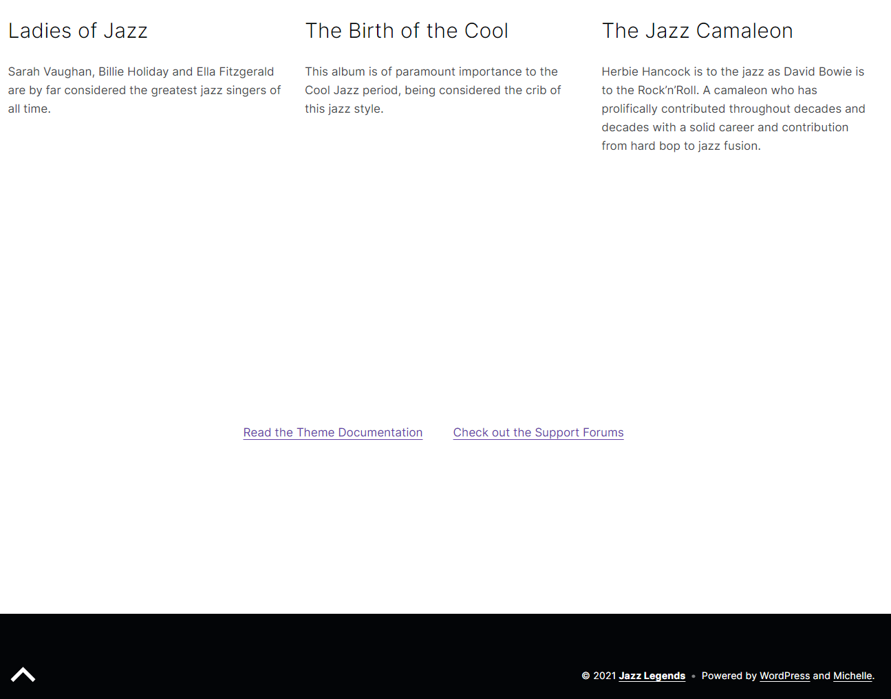

<h1 align=center>
	<b>Bonus Part</b>
</h1>

<p align=center>
	This is the implementation guide for the bonus part of the `born2beroot` project. In here, we will describe the implementation of a Wordpress site and a service of our choice in both the operating systems defined by the project. The bonus implementation of the other partitioning scheme was already explained during both the <a href="https://github.com/caroldaniel/42sp-cursus-born2beroot/blob/991387eb0b1d41ad5c732b2d14554af23e234b4c/guides/Debian-en.md">Debian</a> and the <a href="https://github.com/caroldaniel/42sp-cursus-born2beroot/blob/991387eb0b1d41ad5c732b2d14554af23e234b4c/guides/CentOS-en.md">CentOS</a> implementation guides, so you might want to check those out first. 
</p>

---
<h2 align=center> Index </h2>
<h3 align="center"><b>
	<a href="#WP">Wordpress</a>
	<span> • </span>
	<a href="#ltpd">Lighttpd</a>
	<span> • </span>
	<a href="#DB">MariaDB</a>
	<span> • </span>
	<a href="#PHP">PHP</a>
	<span> • </span>
	<a href="#Instr">Instructions</a>
	<span> • </span>
	<a href="#F2b">Fail2ban</a>
	<span> • </span>
	<a href="#ref">References</a>
</b></h3>

---
<h2 id="WP">
	Wordpress
</h2>

**Wordpress** is a Content Manager System (CMS). In other words, it's an application that allows you to create blogs and websites, and was originally designed to be a simple, user-friendly platform so that anyone, anywhere, could create a functional website.

In this project, we will have to set up a Wordpress website so that our server works as host to it. We will need to set up `http` , `Database` and `PHP` services, and make sure the website or blog is completely functional. 

We will also need to deal with our firewall and MAC systems in order to allow communication through the correct ports. But first, let`s understand the services we will need to install beforehand. 

---
<h2 id="ltpd">
	Lighttpd
</h2>

**Lighttpd** is an open-source web server known for being fast, secure and optimized for less memory consumption than its pairs. 

> For CentOS, you will need the `EPEL` repository in order to install `lighttpd`. You already downloaded it during the `UFW` installation, but if you need, here's the command one more time:
> ```sh
> # dnf install -y epel-release
> ```

Now you can install lighttpd.

In CentOS:
```sh
# dnf install lighttpd
```
In Debian:
```sh
# aptitude install lighttpd
```

After installation is complete, you can use the following commands to start and enable lighttpd at startup. Don't forget to also check its status and current version. The output should appear like this on [CentOS](screenshots/40.png)
```sh
# lighttpd -v
# systemctl start lighttpd
# systemctl enable lighttpd
# systemctl status lighttpd
```

Now, you will need to allow HTTP traffic in you Firewall.
```sh
# ufw allow http
``` 
The default port for `http` traffic is `80`. Make sure it is already [included](screenshots/41.png) on your firewall settings. 
```sh
# ufw status
``` 
> Now, if you're using CentOS, you must make sure SELinux is also permiting communication through port 80. To do so, check the HTTP ports and include 80 in your allowed list if its not already there (by default it usually is) by the following commands:
> ```sh
> # semanage port -l | grep http
> # semanage port -a -t http_port_t -p tcp 80
> ```

---
<h2 id="DB">
	MariaDB
</h2>

**MariaDB** is an open source database management system that is a sort-of replacement for the MySQL database tecnology, being very much compatible and even sharing some of its own commands. It is SQL based and completely free. 

To install `MariaDB` on your server, you must do the following steps:

In CentOS:
```sh
# dnf install mariadb-server
```
In Debian:
```sh
# aptitude install mariadb-server
```

Same thing as done in `lighttpd`, you must make sure to start and enable `MariaDB` on startup:
```sh
# systemctl start mariadb
# systemctl enable mariadb
# systemctl status mariadb
```

Then, you should make sure tu secure MariaDB server with the following command:

```sh
# mysql_secure_installation
```
You should configure your MariaDB like [this](screenshots/42.png) and [this](screenshots/43.png): 

```sh
# Switch to unix_socket authentication [Y/n]: Y
# Enter current password for root (enter for none): Enter
# Set root password? [Y/n]: Y
# New password: C1t1zenK4ne | M1lesD4vis
# Re-enter new password: C1t1zenK4ne | M1lesD4vis
# Remove anonymous users? [Y/n]: Y
# Disallow root login remotely? [Y/n]: Y
# Remove test database and access to it? [Y/n]:  Y
# Reload privilege tables now? [Y/n]:  Y
```

Then, you must restart `MariaDB` service:
```sh
# systemctl restart mariadb
```

Now that you already have a database management system intalled, you will need to configure a Database to host your Wordpress site. 
```sh
# mysql -u root -p
```
You will be asked to enter your DB password. Then, you can create de Database for your Wordpress site. The final result should look like [this](screenshots/45.png). To do so, use the following comands on the MariaDB terminal:

On CentOS:

```txt
MariaDB [(none)]> CREATE DATABASE wordpress;
MariaDB [(none)]> CREATE USER 'admin'@'cado-car42' IDENTIFIED BY 'WPadm1n';
MariaDB [(none)]> GRANT ALL ON wordpress.* TO 'admin'@'cado-car42' IDENTIFIED BY 'WPadm1n' WITH GRANT OPTION;
FLUSH PRIVILEGES;
EXIT;
```
On Debian:

```txt
MariaDB [(none)]> CREATE DATABASE wordpress;
MariaDB [(none)]> CREATE USER 'admin'@'localhost' IDENTIFIED BY 'WPadm1n';
MariaDB [(none)]> GRANT ALL ON wordpress.* TO 'admin'@'localhost' IDENTIFIED BY 'WPadm1n' WITH GRANT OPTION;
FLUSH PRIVILEGES;
EXIT;
```

---
<h2 id="DB">
	PHP
</h2>

**PHP** is a well-known and open-source scripting language for servers that is quite popular to develop web pages. You will need to install it in order to allow proper functioning of the Wordpress website you will try to create. For this activity, we will install the last available PHP version, which currently is `8.0`.

> If you're using `CentOS`, you will need `EPEL` repository again for this one (check <a href="#ltpd">lighttpd</a> for information on how to download it). Also, you will need to download `Remi`, a third-party repository that provides a wide range of PHP versions for RedHat Enterprise Linux - including its most recent one. 
> ```sh
> # dnf install https://rpms.remirepo.net/enterprise/remi-release-8.rpm
> ```
> Confirm its [modules](screenshots/44.png):
> ```sh
> # dnf module list php
> ```
> And then enable its last version:
> ```sh
> # dnf module enable -y php:remi-8.0
> ```

> If you're using Debian you you need to install some repositories in order to be able to install `php 8.0`. 
> ```sh
> # aptitude install -y lsb-release ca-certificates apt-transport-https software-properties-common
> # echo "deb https://packages.sury.org/php/ $(lsb_release -sc) main" | sudo tee /etc/apt/sources.list.d/sury-php.list
> # wget -qO - https://packages.sury.org/php/apt.gpg | sudo apt-key add -
> # aptitude update
> # aptitude install php8.0
> ```

You must install PHP and some of its modules that might be helpful to create a full operational Wordpress website. Only `php-cgi` `php-common` `php-cli` and `php-mysql` are in fact, fundamental to this project. However, I chose to download some other in order to, in the future, be able to expand my website's functionality. You may choose any packages you may find interesting. 

In CentOS:
```sh
# dnf install php-cgi php-common php-cli php-mysql php-gd php-imagick php-recode php-tidy php-xml php-xmlrpc php-fpm
```
In Debian:
```sh
# aptitude install php-cgi php-common php-cli php-mysql php-gd php-imagick php-recode php-tidy php-xml php-xmlrpc php-fpm
```

This is the part where CentOS and Debian diverge a great deal. Let's break it into two parts:

### **In CentOS:**

After this, you can install `lighttpd-fastcgi`:

```sh
# dnf install lighttpd-fastcgi
```

Now, since you installed `php-fpm` and `lighttpd-fastcgi`, you must configure some details. 

First, you'll [edit](screenshots/47.png) the PHP-FPM configuration file:

```sh
# vim /etc/php-fpm.d/www.conf
```
Then, you will edit the PHP configuration and uncomment [this](screenshots/48.png) line:
```sh
# vim /etc/php.ini
```

Next, you need to edit a file called `modules.conf` like [this](screenshots/53.png).
```sh
# vim /etc/lighttpd/modules.conf
```

Then, open a fourth file called `/etc/lighttpd/conf.d/fastcgi.conf` and edit [these lines](screenshots/54.png).
```sh
# vi /etc/lighttpd/conf.d/fastcgi.conf
```

Lastly, you must make sure that your SELinux is allowing connection to your `http server` and your `database`:
```sh
# setsebool -P httpd_can_network_connect 1
# setsebool -P httpd_can_network_connect_db 1
```

You will need to start and enable PHP-FPM on boot:
```sh
# systemctl start php-fpm
# systemctl enable php-fpm
```
Then, you must make sure that `lighttpd` is getting the correct folder in which your wordpress data is (`/var/www/html/`). To do so, change your lighttpd server root location to be like [this](screenshots/61.png).

```sh
# vim /etc/lighttpd/lighttpd.conf
```

### **In Debian:**

After installing all the php packages, you will need to configure some extra details. First, you will need to make sure `Apache2`is not installed in your server. It might be so thanks to php dependencies or even a pre-installation option you might have accidentely flagged. If it is, remove it completely from it, as so not to create any clashes between the two http servers.

```sh
# aptitude purge apache2
```
Then, you will need to configure some php info, make it look like [this](screenshots/d69.png):

```sh
# vim /etc/php/8.0/cgi/php.ini
```
Another php file to look like [this](screenshots/d70.png):
```sh
# vim /etc/php/8.0/fpm/pool.d/www.conf
```

Now, make sure you configure you fastcgi file to contain some information on host and port, like [this](screeshots/d68.png).
```sh
# vim /etc/lighttpd/conf-available/15-fastcgi-php.conf
```

Now, you must activate the modules for `fastcgi` using the following comands:
```sh
# lighty-enable-mod fastcgi
# lighty-enable-mod fastcgi-php
```
### **For both CentOS and Debian**

Now you can check if your connection is working properly by creating an [information file](screenshots/51.png) to be displayed at your local browser:
```sh
# vi /var/www/html/info.php
```
Then you can try and access it going to you `http://'your-ip-address'/info.php`. Your webpage should display something like [this](screenshots/52.png).

If everything is according to the plan, you can now install and create your Wordpress website. 

---
<h2 id="Instr">
	Instructions
</h2>

To install **Wordpress** into your computer, you must first make sure you have the `wget` and `tar` packages installed. 

In CentOS:
```sh
# dnf install wget
# dnf install tar
```
In Debian:
```sh
# aptitude install wget
# aptitude install tar
```

After that, you can download the latest available release of Wordpress and unzip it:
```sh
# wget http://wordpress.org/latest.tar.gz
# tar -xzvf latest.tar.gz
# mv wordpress/* /var/www/html/
# rm -rf latest.tar.gz wordpress
```

Create a Wordpress configuration file from its downloaded sample, and then edit it:
```sh
# mv /var/www/html/wp-config-sample.php /var/www/html/wp-config.php
# vim /var/www/html/wp-config.php
```

You must alter the 3 lines that specify the `DB name`, `DB user`, `DB password` and `DB host`, like [this](screenshots/46.png).

Lastly, you must change your wordpress folders permitions:

In CentOS:
```sh
# chown -R lighttpd:lighttpd /var/www/html/wordpress
# chmod -R 755 /var/www/html/wordpress
# chcon -t httpd_sys_rw_content_t /var/www/html/wordpress -R
```
In Debian:
```sh
# chown -R www-data:www-data /var/www/html/
# chmod -R 755 /var/www/html/
```

At last, restart `lighttpd` againg and we are finally able to go to the computer's browser and typed:

```txt
http://192.168.15.181/
```
And
```txt
http://192.168.15.121/
```

The [configuration menu](screenshots/55.png) for Wordpress should appear. You may configure it as you wish, [these](screenshots/56.png) are my configuration settings, and [these](screenshots/d71.png) are [@]HCastanh](https://github.com/HCastanha)'s. Once it's all set, you may configure it as you wish: the sky is the limit!

At the end, my Wordpress website looked like this:





And Herbie's looked like this:




---
<h2 id="F2b">
	Fail2ban
</h2>

We decided to install, as part of the last bonus task, `Fail2Ban`, a service that gives an extra layer of protection to any other service that connects through password with your server. 

`Fail2Ban` finds failed login attempts using your service's `log` and blocks new attempts at login from those IPs. In doing so, it disencourages hackers and people with malicious intetions from accessing your server in full. 

We will install `Fail2Ban` and configure it so it blocks remote attempts from SSH connections that typed the wrong password more than a few times.

`Fail2Ban` can be found on the `EPEL` repository, which was already enabled previously on our machine. You can install it normally:

In CentOS:

```sh
# dnf install fail2ban
```
In Debian:

```sh
# aptitude install fail2ban
```
Then, you can start it. I chose **not** to enable it at startup:
```sh
# systemctl start fail2ban
```

You will need to create and edit the `/etc/fail2ban/jail.local` with some [new configuration settings](screenshots/60.png) regarding ssh service, in order to activate `fail2ban` on your computer. You must then restart the service.

```sh
# cp /etc/fail2ban/jail.conf /etc/fail2ban/jail.local
# systemctl restart fail2ban
# systemctl status fail2ban
```

Since we're using a different port for ssh (port 4242), we will also need to edit the `/etc/fail2ban/jail.conf` to add the ssh port accordinly. You may choose to edit everything through this file, if you prefer. 

To find status of failed and banned IP address, and the log file for `fail2ban`:
```sh
# fail2ban-client status
# fail2ban-client status sshd
# tail -f /var/log/fail2ban.log
```

---
<h2 id="ref">
	References
</h2>

<p><a href="https://wordpress.com/"><i><b>Wordpress Website</b></i></a></p>
<p><a href="https://www.lighttpd.net/"><i><b>Lighttpd Website</b></i></a></p>
<p><a href="https://mariadb.org/"><i><b>MariaDB Website</b></i></a></p>
<p><a href="https://www.osradar.com/install-wordpress-with-lighttpd-debian-10/"><i><b>How to install WordPress with lighttpd on Debian 10?</b></i></a></p>
<p><a href="https://www.tecmint.com/install-lighttpd-with-php-fpm-mariadb-on-centos/"><i><b>How to Install Lighttpd with PHP and MariaDB on CentOS/RHEL 8/7</b></i></a></p>
<p><a href="https://computingforgeeks.com/how-to-install-php-on-debian-linux/"><i><b>How to Install PHP on Debian 11</b></i></a></p>